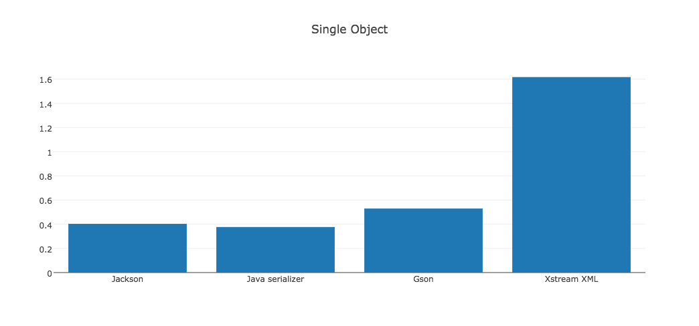
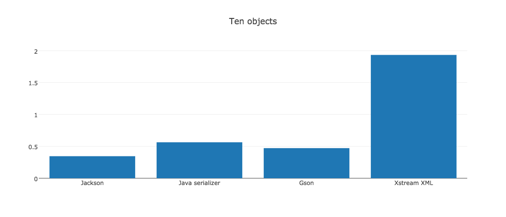
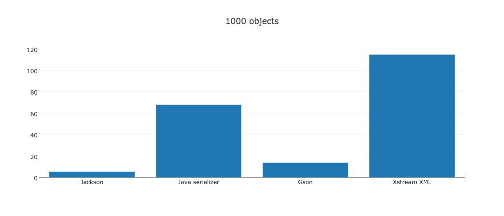

## Jvm Internals
#### Łukasz Jercha
[](https://travis-ci.org/ljercha/jvm)

Laboratorium 01
***
> Aplikacja rzuca wyjątkiem OutOfMemoryExpection, gdyż wypełniam całą stertę alokując pamięc metodą rekurencyjnie.
>   Z [dokumentacji](http://docs.oracle.com/javase/7/docs/technotes/tools/windows/java.html#nonstandard) wynika iż można modyfikować wielkość sterty.  

Uruchomienie projektu:
```bash

 mvn compile -f lab01
 mvn exec:java -f lab01 -Dexec.mainClass="lab01.Main"
 ```

***
Laboratorium 02  
Wyniki aplikacji:
  
  
> REFLEKSJA wywolanie metody:562.1315 ns
  
> REFLEKSJA odczytanie zmiennej:958.7505 ns 
  
> REFLEKSJA zapisanie zmiennej:885.8244 ns
  
> NORMALNE wywolanie metody:103.33035 ns
  
> NORMALNE odczytanie zmiennej:71.61855 ns
  
> NORMALNE zapisanie zmiennej:189.40955
  

***
Laboratorium 03  
Projekt zawiera 2 klasy testowanie za pomocą unit testów w porównaniu do jacksona.  

Uruchomienie projektu:
```bash

 mvn test
 ```
  
  
Laboratorium 06
***
> Aplikacje można uruchomić z crashem związanym z brakiem multi-threading klassy SimpleDateFormat jak  i bezpiecznie

Uruchomienie ThreadCrash:
```bash

 mvn compile -f lab06
 mvn exec:java -f lab01 -Dexec.mainClass="ThreadCrash.Main"
 ```

Uruchomienie ThreadSafeLocal:
```bash

 mvn compile -f lab06
 mvn exec:java -f lab01 -Dexec.mainClass="ThreadSafeLocal.Main"
 ```


Laboratorium - Benchmark serializacji

Wyniki:

> Single object
Jackson: 0.4030937215650591  
Java serialize: 0.37670609645131936  
Gson serialize: 0.5295723384895359  
Xstream serialize: 1.6169244767970883  
10 object  
Jackson: 0.34576888080072793  
Java serialize: 0.5641492265696088  
Gson serialize: 0.47224749772520475  
Xstream serialize: 1.9335759781619655  
1000 object  
Jackson: 5.4066985645933014  
Java serialize: 67.86124401913875  
Gson serialize: 13.68421052631579  
Xstream serialize: 114.73205741626795  
> 
***






Uruchomienie lab-serializacja
```bash

 mvn compile -f lab-serializacja
 mvn exec:java -f lab-serializacja -Dexec.mainClass=serializacja.Main

```
